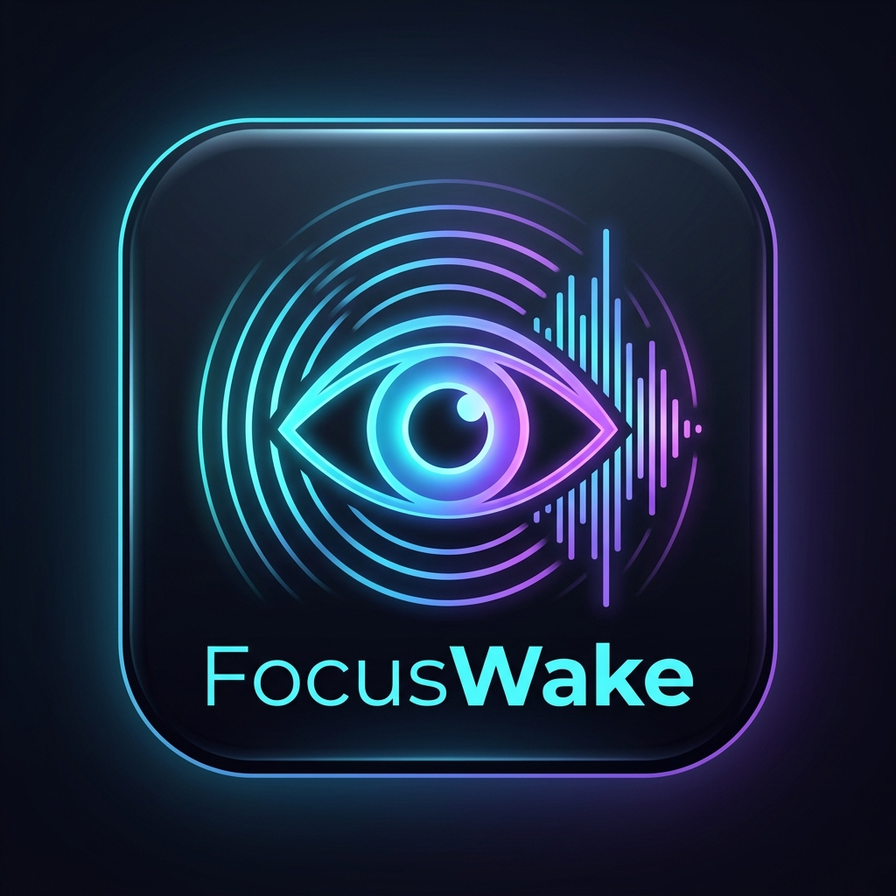

# 👁️⚡ Anti-Distraction — Sentinela para Vídeos, Aulas e Reuniões

<p align="center">
  
</p>

<p align="center">
  <strong>Aplicativo Web e Extensão que escuta e transcreve suas aulas, vídeos do YouTube, lives e reuniões, disparando alertas sonoros e visuais no instante em que palavras-chave escolhidas por você forem mencionadas.</strong>
</p>

<p align="center">
  
  
  
  
</p>

---

## 💡 O Problema que o Anti-Distraction Resolve

Você já se pegou distraído durante:
- Uma aula longa da faculdade ou curso online?
- Uma reunião remota (Google Meet, Teams, Zoom) esperando chamarem o seu nome?
- Uma live ou webinar esperando um aviso de sorteio, cupom ou exercício?

O **Anti-Distraction** atua como uma sentinela atenta em segundo plano. Ele monitora a transmissão em tempo real e, quando alguém pronuncia termos críticos como seu **nome**, *"prova"*, *"trabalho"*, *"urgente"*, *"pergunta"* ou qualquer palavra personalizada, ele **te acorda imediatamente com alertas sonoros sintetizados, notificações na área de trabalho e flashes na tela**.

---

## 🔄 Sincronização em Tempo Real (Site ⇄ Extensão)

O **Anti-Distraction** possui uma ponte de sincronização bidirecional:
- Toda palavra-chave adicionada ou removida no site `index.html` **aparece automaticamente na extensão**.
- Toda palavra-chave configurada no menu da extensão **aparece automaticamente no site**.
- O botão de ativar/desativar também sincroniza entre os dois ambientes!

---

## 🎧 Guia Definitivo: Como o Anti-Distraction Escuta os Vídeos

Diferente de um microfone comum, o computador trata áudios de formas diferentes dependendo de como você está assistindo:

### 1. No YouTube, Google Meet e Lives (A melhor opção: Extensão)
- Instale a extensão que está na pasta `extension/`.
- Ao abrir o YouTube ou Google Meet, um widget flutuante surgirá no canto da tela:
  `[ 👁️ Anti-Distraction: ATIVO | Ouvindo: "..." | ⏸️ Desativar ]`
- O letreiro mostra em tempo real o que o vídeo acabou de falar!
- **Importante sobre Legendas no YouTube:** A extensão tenta ativar as legendas automaticamente. Se o vídeo não tiver legendas ativas, o widget avisará: *"⚠️ Legenda do YouTube desligada! Ative no CC"*. Basta clicar no botão de CC do player!

### 2. Em Vídeos Salvos no Computador (Gravações de Aulas, MP4, MP3)
- Abra o site [`index.html`](index.html).
- No card **"📁 Abrir Vídeo/Áudio do Computador"**, clique em **Escolher Arquivo** e selecione o arquivo.
- O vídeo roda direto dentro do Anti-Distraction com visualizador de frequência e monitoramento de palavras!

### 3. Usando Alto-Falantes vs. Fones de Ouvido
- **Com Alto-Falantes:** O microfone do seu notebook/PC escuta o som ambiente. Ative o **Amplificador de Ganho (1x a 5x)** no painel para facilitar a captação de vozes baixas.
- **Com Fone de Ouvido:** Quando você usa fones, o som do computador não sai no ar para o microfone ouvir. Nesse caso, **use a Extensão Anti-Distraction no navegador**, pois ela lê o vídeo digitalmente por dentro do Chrome sem depender do microfone físico!

---

## ✨ Principais Funcionalidades

1. **🚨 Sinais Sensoriais Anti-Distração:**
   - 🔔 Sintetizador sonoro Web Audio (Chime duplo, radar sonar, alerta sci-fi, despertador).
   - ⚡ Borda de tela piscante com laser vermelho para visão periférica.
   - 💬 Notificação de Área de Trabalho mesmo com o navegador minimizado.
   - 🗣️ Voz do sistema (TTS): *"Atenção: palavra-chave detectada!"*.
2. **🎛️ Controle Total On/Off:**
   - Botão Master no popup da extensão.
   - Widget flutuante direto na tela do YouTube/Meet com status em tempo real.
3. **🎚️ VU Meter & Ganho de Áudio:** Barra colorida que pula indicando os decibéis que entram no sistema.
4. **🎯 Presets Prontos:** *🎓 Aulas & Provas*, *💼 Reunião & Daily*, *📺 Lives & Sorteios*.

---

## 🧩 Como Instalar a Extensão no Chrome / Edge

1. Abra seu navegador e acesse:
   ```
   chrome://extensions
   ```
2. Ative a chave **"Modo do desenvolvedor"** (canto superior direito).
3. Clique em **"Carregar sem compactação"** *(Load unpacked)* e selecione a pasta `extension/` deste projeto.
4. *(Se já havia carregado antes, clique no ícone de recarregar 🔄 no card do Anti-Distraction)*.
5. Abra qualquer vídeo do YouTube ou Google Meet e veja a sentinela atuar!

---

## 🚀 Como Publicar e Acessar no GitHub

### Método 1: Script Automático
Execute o arquivo `setup_github.bat` com um duplo-clique. Ele verificará seu Git e solicitará o link do seu repositório no GitHub para fazer o upload automaticamente.

### Método 2: Comandos Manuais pelo Terminal
```bash
git init
git add .
git commit -m "feat: Anti-Distraction app and chrome extension"
git remote add origin https://github.com/SEU_USUARIO/anti-distraction.git
git branch -M main
git push -u origin main
```

### Método 3: Pelo Navegador
1. Crie um repositório no [github.com/new](https://github.com/new).
2. Clique em **"uploading an existing file"**, arraste todos os arquivos desta pasta e confirme o commit!
3. Vá em **Settings > Pages** e ative o **GitHub Actions** para ter o site online gratuitamente!

---

## 📁 Estrutura de Arquivos

```
nova-pasta-6/
├── assets/
│   ├── logo.jpg               # Logo oficial Anti-Distraction
│   ├── favicon.png            # Ícone 32x32 para web
│   └── icon-128.png           # Ícone 128x128
├── css/
│   └── style.css              # Design System moderno, responsivo e temas
├── js/
│   └── app.js                 # Motor de sincronização, transcrição e áudio
├── extension/                 # Extensão Oficial Manifest V3
│   ├── manifest.json          # Manifest V3 (Anti-Distraction)
│   ├── popup.html             # Painel popup da extensão
│   ├── popup.css              # Estilos do popup
│   ├── popup.js               # Lógica de controle e sincronização bidirecional
│   ├── content.js             # Observador de legendas, ticker e bridge
│   ├── content.css            # Estilos do widget e HUD flutuante
│   ├── background.js          # Service worker e notificações
│   └── icons/                 # Ícones 16, 32, 48 e 128px
├── .github/
│   └── workflows/
│       └── deploy.yml         # Deploy automático no GitHub Pages
├── .gitignore
├── LICENSE                    # Licença MIT
├── setup_github.bat           # Script para subir ao GitHub facilmente
├── start_app.bat              # Script para iniciar localmente em 1 clique
├── index.html                 # Aplicação Web Anti-Distraction
└── README.md                  # Documentação completa
```

---

## 📄 Licença
Distribuído sob a licença **MIT**.
